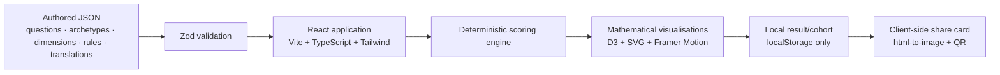
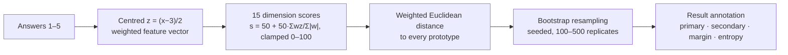

# LUMINA LabType

**Your research personality, visualised as data · 你的科研人格，被可视化成数据**

LUMINA LabType is a fictional, for-entertainment research-work-style personality test that dresses a
deterministic scoring engine in the visual language of a high-dimensional data-analysis pipeline —
feature vectors, normalisation, PCA, clustering, nearest prototypes and bootstrap resampling — while
staying explicit that the archetypes are pure fiction.

Everything runs **entirely in the browser**: no backend, no shared database, no AI API, no
analytics, no account, no transmission of answers. The optional cohort database is local to the
browser and stores only derived result vectors. It deploys as a static site to GitHub Pages.

> ⚗️ *This is not a scientific instrument, a psychological assessment, a diagnostic tool, or an
> employment screen. It is an interactive toy for reflection and amusement.*

## Screenshots

| Landing | Result | ML Lab |
| --- | --- | --- |
| *(screenshot placeholder)* | *(screenshot placeholder)* | *(screenshot placeholder)* |

## Feature overview

- **36 fictional work-style questions** on a five-point scale, in Simplified Chinese, Traditional
  Chinese and English
- **15 dimensions** in five groups (question / evidence / execution / collaboration / sustainability)
- **21 archetypes** (18 visible + 3 hidden, rule-triggered), each with a 15-dimensional prototype
  vector and a procedurally drawn abstract emblem
- **Deterministic scoring** — identical answers always produce identical results
- An animated **analysis pipeline** (9 stages, skippable, <2 s under reduced motion)
- A coherent suite of **mathematical visualisations**: dimension radar, response heatmap, PCA map,
  nearest-neighbour map, contribution scatter, behavioural-theme dot plot, decision flow,
  archetype similarity matrix, entropy gauge, bootstrap stability, k-means demonstration,
  archetype similarity tree (dendrogram + radial), and a draggable decision-region playground
- **ML Lab** page with academic + plain-language explanations for every concept
- **Share cards** (square / portrait / WeChat portrait / landscape) exported client-side as PNG with
  a QR code — no answers ever included
- Optional **cohort atlas**: users can save derived result vectors as local "cells" and view them in
  a scRNA-seq-style PCA/k-means cluster plot
- Full **i18n**, **reduced motion**, **reduced computation**, **keyboard navigation**, and a
  data-table alternative for every chart

## Architecture



### Decision process



### Repository layout

```
src/
  app/            store (Zustand), layout, routing, hooks
  components/     ChartFrame, Emblem, ProfileBars, switchers
  features/
    scoring/      deterministic engine + bootstrap stability
    pipeline/     animated pipeline stage art
    results/      prose composer, useResult hook
    visualisations/  all charts + synthetic data + palette
    sharing/      share-card generator
  data/
    archetypes/ dimensions/ configuration/ translations/   authored JSON (versioned)
    schemas.ts  content.ts   Zod schemas + validated loader
  lib/
    mathematics/  statistics, PCA (Jacobi), clustering, seeded RNG
    storage/ templates/ basePath.ts
  workers/        bootstrap Web Worker
scripts/          content validation, SPA fallback, bundle report
tests/            fixtures, unit setup, Playwright e2e
```

## Scoring model

1. Each answer x ∈ {1..5} is centred: **z = (x − 3) / 2** ∈ [−1, 1].
2. Question q contributes signed weights w(q,d) to one or more dimensions (reverse-coding =
   negative weight). Dimension score: **s(d) = 50 + 50 · Σ w·z / Σ |w|**, clamped to 0–100.
   Unanswered questions simply don't contribute; a dimension with no signal stays at 50.
3. Classification = **weighted Euclidean distance** to each archetype's 15-d prototype vector,
   with per-dimension importance α(d). Stable tie-break: smallest weighted distance → highest
   cosine similarity → alphabetical code.
4. Hidden archetypes are unlocked by explicit deterministic rules
   ([hidden-rules.json](src/data/configuration/hidden-rules.json)) and never accuse anyone of
   anything.
5. Display metrics: **match strength** (softmax of negative distances, documented temperature —
   *not* a probability), **classification margin** (gap between the two nearest), **normalised
   entropy** H/log K over the nearest K, and **bootstrap stability** (fraction of seeded
   question-resampling replicates that reproduce the primary archetype).

Cosine similarity, Pearson and Spearman correlations are computed for explanation only.

## Scientific honesty

Genuinely computed at runtime: dimension scores, all distances and correlations, PCA (covariance +
Jacobi eigendecomposition of the prototype/synthetic matrix — never hard-coded coordinates),
hierarchical clustering (Lance–Williams), k-means, silhouette scores, entropy, and seeded bootstrap
resampling.

Editorial fiction: the archetypes, their prototype vectors, the question weights, and every
interpretation. The app never shows p-values, significance, FDR, confidence intervals, accuracy
claims, or validation datasets — because none exist. The contribution plot borrows the two-axis
grammar of feature-importance plots without any statistics; "theme enrichment" means relative
concentration of weighted responses, not pathway enrichment; the similarity tree is clustering,
not ancestry. See the in-app **Methodology** page.

## Synthetic reference profiles

Clustering and projection views scatter deterministic, seeded points around each prototype
(bounded Gaussian noise, clamped to 0–100) purely to make the maps legible. They are labelled
"Synthetic reference profiles", represent nobody, can be hidden with one toggle, and are reduced
in count under reduced-computation mode. Generator: [synthetic.ts](src/features/visualisations/synthetic.ts).

## Privacy

- No backend, no shared database, no cookies, no analytics, no font/CDN dependency at runtime.
- Answers, language, settings and optional cohort result vectors live only in `localStorage` under
  `lumina:` keys.
- A delete button (result page and Privacy page) erases every stored value.
- Share cards never contain raw answers.

## Local development

```bash
npm install
npm run dev        # http://localhost:5173/lumina-labtype/
```

Quality gates:

```bash
npm run check      # validate content + lint + typecheck + unit tests
npm run test       # unit tests (Vitest)
npm run test:e2e   # Playwright (builds + previews under the Pages subpath)
npm run build      # production build + SPA 404 fallback
npm run analyze    # build + per-asset raw/gzip size report
```

## Testing

- **104 unit tests** cover the maths (distances, correlations, PCA, clustering, RNG), the scoring
  engine (weights, reverse-coding, missing answers, determinism, tie-breaking, hidden rules),
  bootstrap reproducibility, synthetic-data bounds, storage, templates, translation completeness
  (key parity, empty strings, leakage) and base-path handling. Fixed fixtures live in
  [tests/fixtures/profiles.ts](tests/fixtures/profiles.ts).
- **28 Playwright tests** (chromium + mobile emulation) cover the full journey, progress
  restoration, pipeline skipping, deterministic result rendering, chart table access, language
  switching and persistence, share-card PNG export, optional cohort-cell recording, restart,
  local-data deletion, reduced motion, and direct navigation under the GitHub Pages subpath.

## Deploying to GitHub Pages

1. Push this repository to GitHub (default branch `main`).
2. In **Settings → Pages**, set *Source* to **GitHub Actions**.
3. Push to `main`. The workflow ([.github/workflows/deploy.yml](.github/workflows/deploy.yml))
   validates content, lints, type-checks, runs unit + e2e tests, builds with
   `VITE_BASE=/<repo-name>/`, and deploys `dist/`.

No secrets or environment variables are required. The base path is derived from the repository
name automatically; for local preview it defaults to `/lumina-labtype/` (override with
`VITE_BASE=/my-name/ npm run build`).

The optional cohort atlas is browser-local on GitHub Pages. A public, cross-user cohort would need
a hosted backend such as Supabase, Firebase or a small serverless API, plus consent and moderation
rules.

**Custom domain / user site:** set `VITE_BASE=/` in the workflow's build step and add your CNAME
via the Pages settings.

**SPA fallback:** `scripts/spaFallback.mjs` copies `index.html` to `404.html` after every build so
deep links like `/lumina-labtype/result` load directly.

## Content editing guide

All authored content is versioned JSON validated by Zod ([schemas.ts](src/data/schemas.ts)) at
dev-time, build-time (`npm run validate:content`) and in tests.

- **Add a question**: append to `src/data/configuration/scoring-config.json` (id `q37`, signed
  `weights` per dimension, at least one `theme`), then add the question text under `questions.q37`
  in all three translation files. The schema allows 30–36 questions — adjust if extending.
- **Add an archetype**: append to `src/data/archetypes/archetypes.json` (code, 15-value `vector`
  aligned to `dimensionOrder`, emblem `{glyph, seed, hue}`, collaborator codes), then add the full
  `archetypes.<CODE>` block (name, tagline, description, 3 strengths, 3 blind spots, team role,
  reviewer-2 reply, failure mode, advice, keywords, share text) to every translation file.
  `npm run validate:content` will list anything missing.
- **Edit prototype vectors**: values are 0–100 per dimension in `dimensionOrder` (see
  `scoring-config.json`). Unit tests assert each archetype is nearest to its own prototype.
- **Add a language**: create `src/data/translations/<code>.json` with the identical key tree,
  register it in `src/i18n/index.ts`, and the parity tests will enforce completeness.

## Performance

- Lazy-loaded heavy pages (Result / ML Lab / Atlas) and manual vendor chunks; main entry ≈ 92 kB gzip.
- Bootstrap resampling runs in a **Web Worker** (with a synchronous fallback).
- Matrix computations are memoised; synthetic point counts drop under reduced-computation mode.
- No web-font downloads — system font stacks with full CJK coverage.

## Accessibility

Semantic landmarks, skip link, visible focus rings, ≥44 px touch targets, keyboard-reachable chart
cells, a plain-language summary under every chart, an optional data table for complex charts,
non-colour encodings (labels, width, ordering), `prefers-reduced-motion` plus an in-app motion
toggle, and screen-reader summaries on the result page.

## Limitations

- The nonlinear (UMAP-style) view is intentionally **not included**: rather than ship fake
  coordinates or a heavy dependency, the neighbourhood story is told by the (honest) PCA map,
  dendrogram and radial similarity tree. Titling anything "UMAP" that isn't UMAP was ruled out.
- The scoring system is editorial: weights and prototypes are designed, not learned.
- Bootstrap stability measures internal consistency of this fictional system only.
- Exported share cards use system fonts, so exact glyph rendering varies slightly across platforms.
- GitHub Pages cannot collect cross-user cohort cells by itself; the included cohort database is
  local to each browser.

## Licence

MIT. The archetype texts and question sets are original fiction created for this project.
